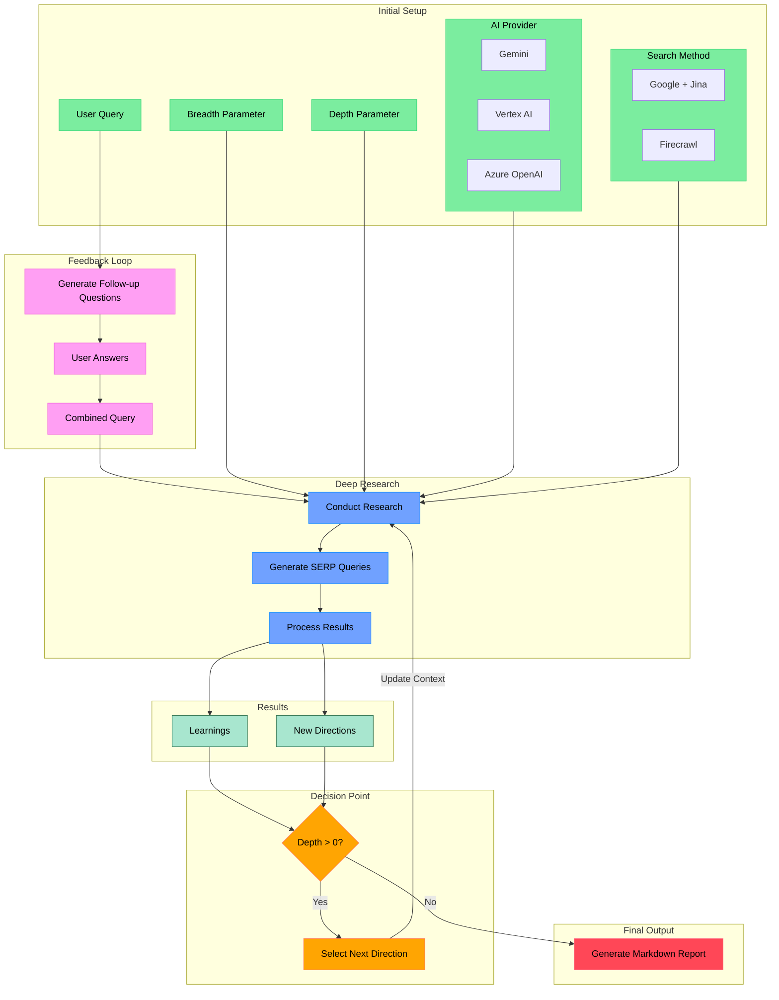
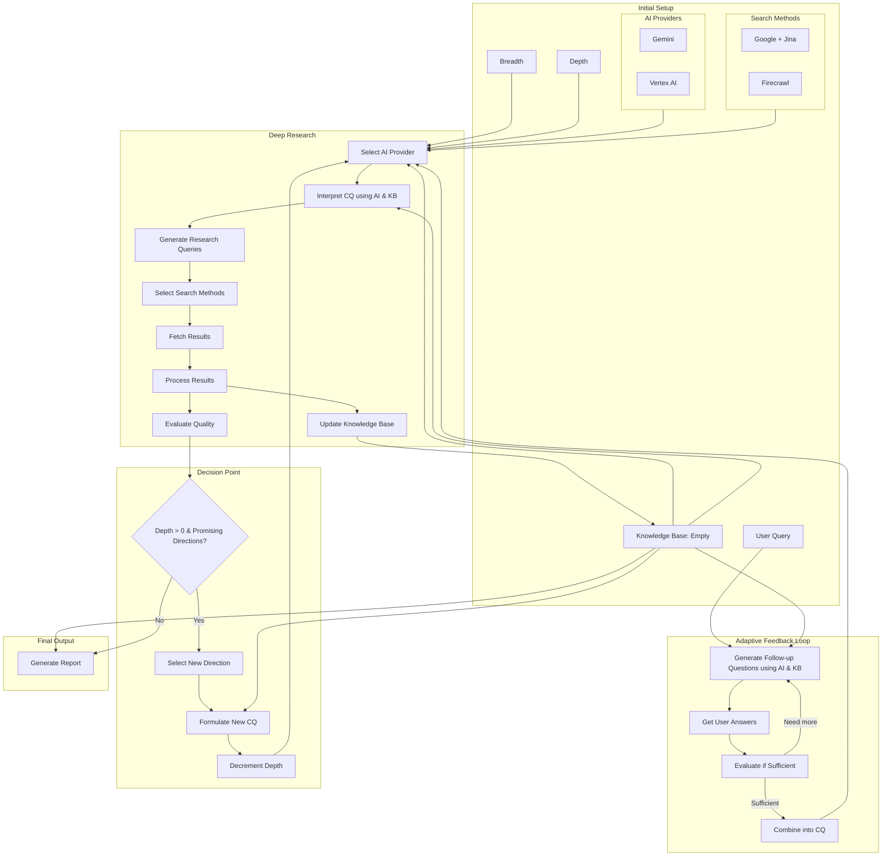

# Open Deep Research

## Introduction

Open Deep Research is a powerful, AI-driven research assistant that combines multiple AI providers (Gemini, Azure OpenAI, Vertex AI) with advanced web search capabilities to perform comprehensive, iterative research on any topic. What sets this tool apart is its ability to:

1. **Flexible AI Integration**: 
   - Supports multiple AI providers including Google's Gemini, Azure OpenAI, and Vertex AI
   - Easy configuration through environment variables
   - Fallback options between providers

2. **Dual Search Capabilities**:
   - Google Custom Search + Jina for web scraping -option 1
   - Firecrawl integration for efficient search and content extraction -option 2
   - Configurable search depth and breadth

3. **Intelligent Research Process**:
   - Adaptive questioning to understand research needs
   - Iterative deep diving into topics
   - Smart context management across search iterations
   - Parallel processing of search queries for efficiency

4. **Production-Ready Features**:
   - Rate limiting and concurrency control
   - Error handling and timeout management
   - Progress tracking and detailed logging
   - Markdown report generation with source attribution

This tool is perfect for researchers, analysts, students, or anyone needing to gather comprehensive information on complex topics quickly and efficiently.

# Purpose:

Customized to used with various AI provider like gemini, Azure OpenAI, VertexAI
You can also use google search engines + jina instead of firecrawl

An AI-powered research assistant that performs iterative, deep research on any topic by combining search engines, web scraping, and large language models.

The goal of this repo is to provide the simplest implementation of a deep research agent - e.g. an agent that can refine its research direction over time and deep dive into a topic. Goal is to keep the repo size at <500 LoC so it is easy to understand and build on top of.

## How It Works



## TODO



## Features

- **Iterative Research**: Performs deep research by iteratively generating search queries, processing results, and diving deeper based on findings
- **Intelligent Query Generation**: Uses LLMs to generate targeted search queries based on research goals and previous findings
- **Depth & Breadth Control**: Configurable parameters to control how wide (breadth) and deep (depth) the research goes
- **Smart Follow-up**: Generates follow-up questions to better understand research needs
- **Comprehensive Reports**: Produces detailed markdown reports with findings and sources
- **Concurrent Processing**: Handles multiple searches and result processing in parallel for efficiency

## Requirements

- Node.js environment
- One of the following API keys:
  - LLM: OpenAI, Vertex or Gemini
  - Search and scrape:
    - Firecrawl API (for web search and content extraction) or
      - Google Search API
      - Google Search Engine ID
      - Jina API Key

## Setup

### Node.js

1. Clone the repository
2. Install dependencies:

```bash
npm install
```

3. Set up environment variables in a `.env.local` file:

```bash
FIRECRAWL_KEY="your_firecrawl_key"

# If you want to use your self-hosted Firecrawl, add the following below:
# FIRECRAWL_BASE_URL="http://localhost:3002"
# if you want to use google search + jina instead of firecrawl
GOOGLE_SEARCH_API="your_google_search_api" #https://developers.google.com/custom-search/v1/overview
GOOGLE_CX="your_google_cx" #https://programmablesearchengine.google.com/controlpanel/all
JINA="your_jina_api_key"
# if you want to use openai
OPENAI_KEY="your_openai_key"
# if you want to use vertex 
# gcloud init
# gcloud auth application-default login
# https://cloud.google.com/sdk/gcloud/reference/auth/application-default/login
GOOGLE_PROJECT_ID="your_google_project_id"
GOOGLE_LOCATION="your_google_location"
# you can also use gemini
GOOGLE_GENERATIVE_AI_API_KEY="your_gemini_api_key"


# Optional: Google Gemini configuration
GEMINI_API_KEY="your_gemini_api_key"
GEMINI_MODEL="gemini-pro"  # or other available Gemini models

# Optional: Azure OpenAI configuration
AZURE_OPENAI_KEY="your_azure_openai_key"
AZURE_OPENAI_ENDPOINT="your_azure_endpoint"
AZURE_OPENAI_MODEL="gpt-4o"  # or other available Azure OpenAI models
```

To use local LLM, comment out `OPENAI_KEY` and instead uncomment `OPENAI_ENDPOINT` and `OPENAI_MODEL`:
- Set `OPENAI_ENDPOINT` to the address of your local server (eg."http://localhost:1234/v1")
- Set `OPENAI_MODEL` to the name of the model loaded in your local server.

### Docker

1. Clone the repository
2. Rename `.env.example` to `.env.local` and set your API keys

3. Run `npm install`

4. Run the Docker image:

```bash
docker compose up -d
```

5. Execute `npm run docker` in the docker service:
```bash
docker exec -it deep-research npm run docker
```

## Usage

Run the research assistant:

```bash
npm start
```

You'll be prompted to:

1. Enter your research query
2. Specify research breadth (recommended: 3-10, default: 4)
3. Specify research depth (recommended: 1-5, default: 2)
4. Answer follow-up questions to refine the research direction

The system will then:

1. Generate and execute search queries
2. Process and analyze search results
3. Recursively explore deeper based on findings
4. Generate a comprehensive markdown report

The final report will be saved as `output.md` in your working directory.

### Concurrency

If you have a paid version of Firecrawl or a local version, feel free to increase the `ConcurrencyLimit` in `deep-research.ts` so it runs a lot faster.

If you have a free version, you may sometimes run into rate limit errors, you can reduce the limit (but it will run a lot slower).

### Custom endpoints and models

There are 2 other optional env vars that lets you tweak the endpoint (for other OpenAI compatible APIs like OpenRouter or Gemini) as well as the model string.

```bash
OPENAI_ENDPOINT="custom_endpoint"
OPENAI_MODEL="custom_model"
```

## How It Works

1. **Initial Setup**

   - Takes user query and research parameters (breadth & depth)
   - Generates follow-up questions to understand research needs better

2. **Deep Research Process**

   - Generates multiple SERP queries based on research goals
   - Processes search results to extract key learnings
   - Generates follow-up research directions

3. **Recursive Exploration**

   - If depth > 0, takes new research directions and continues exploration
   - Each iteration builds on previous learnings
   - Maintains context of research goals and findings

4. **Report Generation**
   - Compiles all findings into a comprehensive markdown report
   - Includes all sources and references
   - Organizes information in a clear, readable format


## Acknowledgements

- [Deep Research](https://github.com/dzhng/deep-research)

## License

MIT License - feel free to use and modify as needed.


